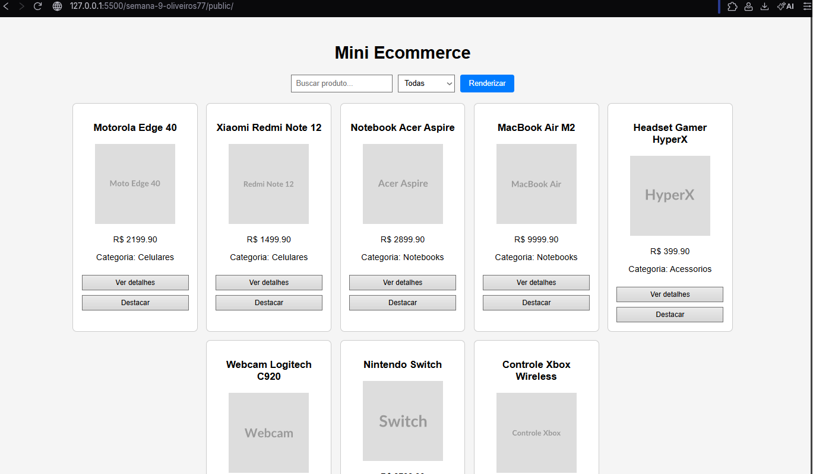
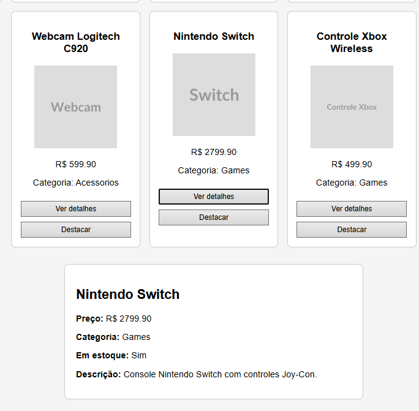
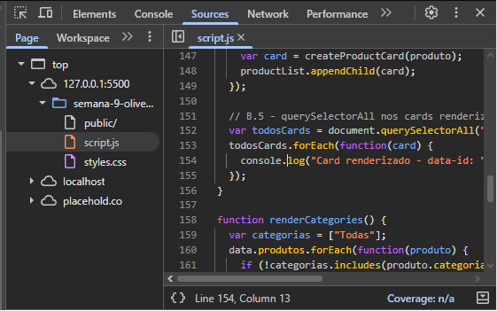
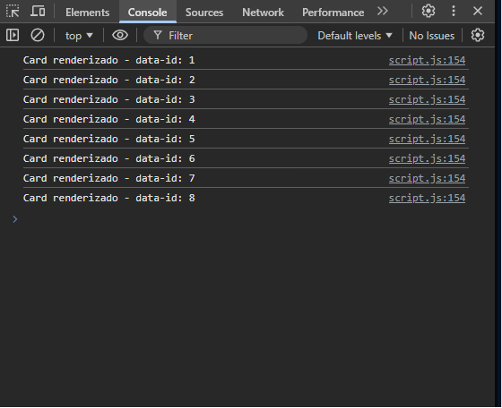

# Trabalho Prático - Semana 9

Nesta atividade, será desenvolvido um programa para praticar o uso de funções em JavaScript e a manipulação do DOM. O objetivo é criar uma tela simples no estilo e-commerce, com a listagem de produtos em cards a partir de um objeto JSON (array de produtos).

## Informações Gerais

- Nome:
- Matrícula:

## Prints do trabalho

TELA DOS PRODUTOS

TELA DE DETALHE DO PRODUTO

PRINT DO CONSOLE

